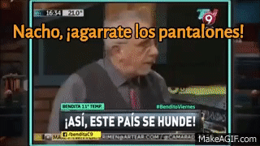

Notas, recursos y pensamientos con todo lo necesario para iniciar en el mundo de la criptografía programable.

<!-- truncate -->

## Hello World

Hace un mes aprox me confirmaban que iba a ser parte del [PSE Core Program](https://pse.dev/en/programs). Un programa de la Ethereum Foundation de 8 semanas que busca educar en criptografía a estudiantes universitarios.

La semana que viene arranca el PSE Core Program y esta semana (week 0) nos introducimos al mundo de las ZK proofs y asentamos algunas bases. Mi idea es ir presentando algunos temas y dejando algunas reflexiones semana a semana. No solo me sirve a mi para asentar conocimientos, sino también puede servir para aquellos que estén interesados en el tema.

A veces pienso que está todo creado, que ya nada puede ser inventado, y luego aparecen cosas como las zk proofs que te dejan pensando "cómo algo así puede ser posible?"

Algo parecido me pasó la primera vez que escuché sobre bitcoin y peor aún cuando leí el [paper](https://bitcoin.org/bitcoin.pdf).

Y si no te interesa, por lo menos lee este post que te va a dejar volando la cabeza, y si te llamás Nacho: **'Nacho, ¡agarrate los pantalones!'**

## ¿Donde está Wally?

Donde está Wally es un libro que tiene imágenes como la de abajo (un quilombo de gente y cosas basicamente) y en la que tu objetivo es encontrar a Wally, un npc en toda regla.

Si de pibe lo conociste y lo jugaste, seguro hayas pasado un buen rato buscandolo, más del que te gustaría admitir.

Quizás en algún momento llegaste a pensar si Wally realmente estaba en la imagen o el libro/autor/editorial te estaba cagando.

### Wally a juicio

Imaginate que sos el hijo de un abogado y le decís a tu viejo que Wally no está en el libro que te compraron, obvio tu viejo lleva a Wally (a la editoria) a juicio.

El jucio es bien fácil, la editorial tiene que probar que Wally se encuentra en la página en la que estabas jugando. Pero hay algo más: como vos no querés que te caguen la sorpresa, la editorial no puede revelar en que posición de la página se encuentra Wally.

### Wait... Wtf?

Demostrar que Wally está, pero sin decir donde está? Parece imposible, pero el abogado defensor además de abogado es un entusiata matemático (nada más alejado de la realidad).

Se le ocurre lo siguiente, poner una gran sábana con un agujero bien chiquito en el centro. Detras de la sábana, colocar la página del libro, alineando justo la cara de Wally con el agujero de la sábana.

Presenta este _set up_ en el juicio y mirando por el agujero, tu viejo se de que Wally está en la página, y además no revela en que parte de la página está para que vos puedas jugar a encontrarlo.

Este es el ejemplo canónico de una Zero Knowledge Proof.

:::info
Si no encontraste a Wally, está arriba a la derecha.
:::

Acá van otros experimentos mentales:

1. [Two balls and the colour-blind friend](https://en.wikipedia.org/wiki/Zero-knowledge_proof#Two_balls_and_the_colour-blind_friend)
2. [The Ali Baba cave](https://en.wikipedia.org/wiki/Zero-knowledge_proof#The_Ali_Baba_cave)

## ZK Proofs

Ahora sí, de lleno en ZK. Espero que los ejemplos anteriores te hayan motivado y ahora estés en modo "Ohhh ok... interesante".

**Una Zero Knowledge Proof es un método criptográfico para probar que algo es cierto, sin revelar ningún tipo de información extra.**

Otro ejemplo canónico de lo que NO es una ZK Proof podría ser el caso en que con tus 18 años recién cumplidos, vas a un boliche con tus amigos. Lllegás a la puerta y el guardia te pide el DNI. En realidad lo que busca es validar que sos mayor de 18 años para poder entrar. Pero en ese proceso, además de verificar tu edad, le **revelas otros datos sensibles como tu número de documento y tu dirección**.

En realidad, en ese momento solo querés demostrar que sos mayor de 18, sin revelar ningún tipo de información extra, una ZK proof sería ideal.

En toda ZK existen dos tipos de personas: un _prover_ aquel que quiere probar algo, y un _verifier_, aquel que verifica si el _statement_ del prover el verdadero.

### Propiedades

Mi idea no era meterme en fundamentalismos, pero es obligatorio nombrar a las tres propiedades que tiene que cumplir una ZK proof:

1. **Completeness**: Si un statement es verdadero, el prover debe poder convencer al verifier de que el statement es verdadero. Muchas veces implica que la probabilidad de dar algo como verdadero siendo falso sea muy baja.
2. **Soundness**: Si un statement es falso, no existe un prover engañoso que pueda convencer al verifier de que la declaración es verdadera, de nuevo con un margen de error muy pequeño.
3. **Zero Knowledge**: Si el statement es verdadero, el verifier no aprende nada más que este hecho.

:::info
Si querés saber más desde lo teórico fijate [este blog post](https://blog.cryptographyengineering.com/2014/11/27/zero-knowledge-proofs-illustrated-primer/)

Te recomiento que intentes entender cómo se prueba la última propiedad.
:::
